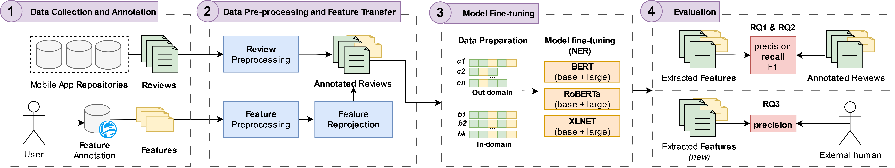

# T-FREX: A Transformer-based Feature Extraction Method for Mobile App Reviews

T-FREX is a transformer-based feature extraction method for mobile app reviews based on fine-tuning Large Language Models (LLMs) for a named entity recognition task. We collect a dataset of ground truth features from users in a real crowdsourced software recommendation platform, and we use this dataset to fine-tune multiple LLMs under different data configurations. We assess the performance of T-FREX with respect to this ground truth, and we complement our analysis by comparing T-FREX with a baseline method from the field. In addition, we explore the potential of:

- **Extended pre-training**: we compare the performance of T-FREX baseline design with a set of encoder-only LLMs with extended pre-training in the field of mobile app reviews using a large dataset from reviews collected from Google Play and other mobile app repositories.

- **Instance selection**: we apply instance selection mechanisms to reduce the size of the training sets to improve performance efficiency while maintaining - or even improving - the functional correctness of feature extraction.

Finally, we assess the quality of new features predicted by T-FREX through an external human evaluation. Results show that T-FREX outperforms on average the traditional syntactic-based method, especially when discovering new features from a domain for which the model has been fine-tuned.

<!------>

## Related Hugging Face Collections

For public access to models related to feature extraction and extended pre-training, check out the following collections:

1. [Fine-Tuned LLMs for Feature Extraction](https://huggingface.co/collections/quim-motger/t-frex-65e98922014f4be34f8bd74c)  
   - A curated collection of models fine-tuned for feature extraction tasks from mobile app reviews.

2. [LLMs with Extended Pre-Training](https://huggingface.co/collections/quim-motger/review-llms-6697b9002c3a5f680eb57572)  
   - This collection features models that have undergone extended pre-training, enhancing their performance on specific tasks in the context of mobile app reviews.


## Structure


This repository is structured in 3 main folders:


- **code** - Contains the software artefacts used for the document pre-processing, feature transfer, LLM fine-tuning, evaluation and use of T-FREX. It also contains a ```requirements.txt``` file to install all required dependencies.

- **data** - Contains the datasets of reviews used for experimentation. This includes the original files and the resulted files after pre-processing and label transferring.

- **evaluation** - Contains extended data on the evaluation results of T-FREX.

In the upcoming sections we refer to the practical use of each of the previous artefacts.

Additionally, we published the fine-tuned versions of the models used for experimentation in the original research, which are ready to be used for model inference (available in the HuggingFace    [collection](https://huggingface.co/collections/quim-motger/t-frex-65e98922014f4be34f8bd74c)):

- [**t-frex-bert-base-uncased**](https://huggingface.co/quim-motger/t-frex-bert-base-uncased)
- [**t-frex-bert-large-uncased**](https://huggingface.co/quim-motger/t-frex-bert-large-uncased)
- [**t-frex-roberta-base**](https://huggingface.co/quim-motger/t-frex-roberta-base)
- [**t-frex-roberta-large**](https://huggingface.co/quim-motger/t-frex-roberta-large)
- [**t-frex-xlnet-base-cased**](https://huggingface.co/quim-motger/t-frex-xlnet-base-cased)
- [**t-frex-xlnet-large-cased**](https://huggingface.co/quim-motger/t-frex-xlnet-large-cased)

Instructions on how to load these models and use them for inference are available [here](https://huggingface.co/docs/transformers/tasks/token_classification#inference).

## Data Pre-processing and Feature Transfer


The ```data``` folder contains two files:


- **reviews.json** - Original JSON file containing the complete set of reviews used in this research before pre-processing, obtained from Motger et al. [1]. *(Note: the file is available in the latest release package as it exceeds the 100GB maximum size limit for GitHub storage).*

- **reviews_annotated.txt** - Generated CoNLL file containing the complete set of reviews after pre-processing and feature transfer.


To transform the original **reviews.json** into the **reviews_annotated.txt** pre-processed, annotated file, you must run the following automatic processes:


1. Run the review pre-processing script to apply the Stanza neural pipeline to the set of reviews and extract the syntactic and morphological features in CoNLL format. This pipeline is configured to run the following steps: tokenization, multi-word token expansion, part-of-speech tagging, morphological feature extraction, and lemmatization.

	```python .\code\document_preprocessing.py -i .\data\reviews.json -o .\data\reviews.txt```

    

2. Run the feature pre-processing script to apply the Stanza neural pipeline to the set of features and extract the syntactic and morphological features in CoNLL format.

	```python .\code\feature_preprocessing.py -i .\data\reviews.json -o .\data\features.txt```

    

3. Run the feature transfer script to apply the label transferring from the app features to the reviews. 

	```python .\code\feature_transfer.py -f .\data\features.txt -r .\data\reviews.txt -o .\data\reviews_annotated.txt```


In addition to the complete dataset of reviews and features, the ```data``` folder contains two sub-folders with the data configurations used in the evaluation and depicted in the original study. Specifically:


- **T-FREX** - Data partitions in CoNLL format (i.e., T-FREX input format).

	- ***out-of-domain*** - Data partitions based on the Google Play category of the app to which the review sentence belongs to. Each sub-folder contains two files: the ```training-set.txt``` and the ```testing-set.txt```.

	- ***in-domain*** - Data partitions with a balanced distribution of app reviews from each Google Play Category, for a 10-fold cross-validation. Each sub-folder contains two files: the ```training-set.txt``` and the ```testing-set.txt```.

- **SAFE** - Datasets in XML format as expected by the SAFE software replication by Shah et al. [2]. Software resources to run the replication from SAFE are available at https://github.com/faizalishah/SAFE_REPLICATION. 	

	- ***out-of-domain*** - Test files based on the Google Play category of the app to which the review sentence belongs to.

	- ***in-domain*** - Test files with a balanced distribution of app reviews from each Google Play Category, for a 10-fold cross-validation.

## Model fine-tuning

The previous folders can be used as input files for experimentation and fine-tuning of multiple LLMs. For simplicity, in this repository we provide the code for running 1 single fine-tuning scennario. Replication of the evaluation tasks can be conducted through automatic runs of the provided code with different parameters.

Below we provide the complete list of LLMs and the specific checkpoints (from https://huggingface.co/) used for experimentation. Additionally, we detail the parameters we used for training. Experiments were conducted on two NVIDIA GeForce RTX 4090 GPUs.

|                    | Model features |        | Training parameters |               |            |
|--------------------|:--------------:|-------:|:-------------------:|--------------:|-----------:|
| **Model**              | data           | params |              epochs (e) | learning rate (lr) | batch size (bs) |
| **bert-base-uncased**  | 16 GB          |  110 M |                   2 |          2e-5 |         16 |
| **bert-large-uncased** | 16 GB          |  336 M |                   2 |          2e-5 |         16 |
| **roberta-base**       | 160 GB         |  125 M |                   2 |          2e-5 |         16 |
| **roberta-large**      | 160 GB         |  355 M |                   2 |          2e-5 |          8 |
| **xlnet-base-cased**   | ~16 GB         |  110 M |                   2 |          3e-5 |         16 |
| **xlnet-large-cased**  | ~113 GB        |  340 M |                   2 |          3e-5 |          8 |

The usage of the fine-tuning script is illustrated below:

```python .\code\fine_tuning.py -m [model] -if [input_folder] -of [output_folder] -e [eval] -ep [epochs] -lr [learning_rate] -bs [batch_size]```

We refer to the required parameters in the following list:

- **model** - ID of the model checkpoint (from from https://huggingface.co/) used to tokenize the reviews and conduct the fine-tuning process for a token classification tasks. Different model architectures require different tokenizers and set up criteria. E.g.: ```bert-base-uncased```

- **input_folder** - Path to the subfolder (from ```data/T-FREX/in-domain``` or  ```data/T-FREX/out-of-domain```) used for training and testing. E.g.: ```.\data\T-FREX\out-of-domain\PRODUCTIVITY\```

- **output_folder** - Path to the folder to save the model checkpoints. E.g.: ```.\models\bert-base-uncased``` 

- **eval** - Evaluation function used to measure quality metrics. It must be either ```token-level``` (i.e., metrics are computed for each token) or ```feature-level``` (i.e., metrics are computed for each feature).

- **epochs** - Total number of training epochs to perform. E.g.: ```2```

- **learning_rate** - Initial learning rate. E.g.: ```'2e-5'```

- **batch_size** - The batch size per device (GPU/TPU core/CPU…) used for training. E.g.: ```16```


Below we provide an example to fine-tune BERT base using the data partition to test out-of-domain PRODUCTIVITY feature extraction (i.e., PRODUCTIVITY feature extraction is evaluated on a model trained with all reviews except from those belonging to a PRODUCTIVITY app, making the PRODUCTIVITY domain an unkwnown field for the model). The script is set to measure quality metrics using a token-level evaluation function, and using the parameters depicted in the previous table.

```python .\code\fine_tuning.py -m 'bert-base-uncased' -if .\data\T-FREX\out-of-domain\PRODUCTIVITY\ -of .\models\bert-base-uncased -e token-level -ep 2 -lr '2e-5' -bs 16```

## Extended pre-training

The extended pre-training script allows for further training of a language model on a specific domain to improve its performance. Below are the instructions to run the extended pre-training process:

1. Prepare the environment:
   - Ensure you have all dependencies installed. You can add them to your requirements.txt file if not already included.
   - Install any missing dependencies using: ```pip install -r requirements.txt```

2. Run the extended pre-training script:
   - ```python code/extended_pretraining.py -f data/reviews_annotated.txt -o models/extended_pretraining -b 16 -e 10 -m bert-base-uncased```

	The parameters are:
	
	    -f or --file: Path to the file containing the raw data.
	    -o or --output: Path to the folder to save the checkpoints.
	    -b or --batch-size: Batch size (default: 16).
	    -e or --epochs: Number of epochs (default: 10).
	    -m or --model: Model name or path from Hugging Face Model Hub.

## Instance selection

The instance selection script is used to select the most representative instances from the dataset for fine-tuning. Below are the instructions to run the instance selection process:

1. Prepare the environment:
   - Ensure you have all dependencies installed. You can add them to your requirements.txt file if not already included.
   - Install any missing dependencies using: ```pip install -r requirements.txt```

2. Run the instance selection script:
   - ```python code/instance_selection.py -if data/T-FREX/out-of-domain -of data/selected_instances -sf bin```

	The parameters are:
	
	    -if or --input-folder: Path to the folder containing the training and test sets.
	    -of or --output-folder: Path to the folder to save the selected instances.
	    -sf or --sub-folders: Sub-folder iteration strategy, either none, category, or bin.

## Evaluation

The ```evaluation``` folder contains extended data for the evaluation results depicted in the original study. Specifically, it has the following structure:

- **token_classification_eval**: Contains ```in-domain``` and ```out-of-domain``` token-level results for each data partition and each model architecture depicted in this package and in the original study. 

- **feature_extraction_eval**: Contains ```in-domain``` and ```out-of-domain``` feature-level results for each data partition and each model architecture depicted in this package and in the original study. 

- **human_eval**: Contains actual annotations from the human evaluation process of new features. The root folder contains two files: ```evaluation_tasks.xlsx```, which contains the full set of review sentences and features extracted by T-FREX; and ```ground_truth_tasks.xlsx```, which contains the subset of review sentences including ground truth annotated features from the original data set. This folder is then classified into the following subfolders:

	- ***eval_tasks_responses***: External human evaluation response files of the evaluation set, classified by Google Play category.

	- ***ground_truth_tasks_responses***: External human evaluation response files of the ground truth set.

	- ***test_tasks_responses***: Internal human evaluation response files of the test set.

## Model inference

To test any of the fine-tuned LLMs as a NER model, we provide an interactive script to manually input any review sentence through the command line. For each input, the script provides: (1) the token classification output as provided by the model, and (2) the list of extracted features aafter arranging all tokens predicted as beginning (*B-feature*) and internal component (*I-feature*) of a feature.

The usage of the script for model inference is shown below:

```python.exe .\code\token_classifier.py --checkpoint [checkpoint]```

Where ```checkpoint``` is the path to the model checkpoint used to load the NER pipeline. For example:

```python .\code\token_classifier.py --checkpoint .\models\bert-base-uncased\checkpoint-1676\```

Below we provide a sample list of review examples for testing:

|Review sentences|
|--------------------|
|*The share note file feature is completely useless.*|
|*Great app I've tested a lot of free habit tracking apps and this is by far my favorite.*|
|*The only negative feedback I can give about this app is the difficulty level to set a sleep timer on it.*|
|*Does what you want witha small pocket size checklist reminder app*|
|*Very bad because call recording notification send other person*|
|*I originally downloaded the app for pomodoro timing, but I stayed for the project management features, with syncing.*|
|*It works accurate and I bought a portable one lap gps tracker it have a great battery Life*|
|*Im my phone the notifications of group message are not at a time please check what was the reason behind it because due to this default I loose some opportunity*|
|*There is no setting for recurring alarms*|

--

**References**

[1] Motger, Q., Franch, X., Marco, J. (2023). Mobile Feature-Oriented Knowledge Base Generation Using Knowledge Graphs. In: Abelló, A., et al. New Trends in Database and Information Systems. ADBIS 2023. Communications in Computer and Information Science, vol 1850. Springer, Cham. https://doi.org/10.1007/978-3-031-42941-5_24

[2] Shah, F.A., Sirts, K., Pfahl, D. (2019). Is the SAFE Approach Too Simple for App Feature Extraction? A Replication Study. In: Knauss, E., Goedicke, M. (eds) Requirements Engineering: Foundation for Software Quality. REFSQ 2019. Lecture Notes in Computer Science(), vol 11412. Springer, Cham. https://doi.org/10.1007/978-3-030-15538-4_2
